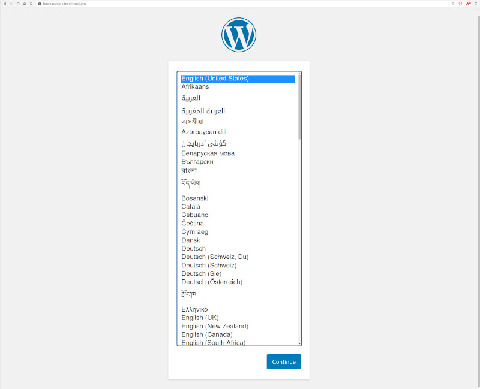

## WordPress with MySQL
This example defines one of the basic setups for WordPress. More details on how this works can be found on the official [WordPress image page](https://hub.docker.com/_/wordpress).


Project structure:
```
.
├── docker-compose.yaml
└── README.md
```

[_docker-compose.yaml_](docker-compose.yaml)
```
services:
  db:
    # We use a mariadb image which supports both amd64 & arm64 architecture
    image: mariadb:10.6.4-focal
    # If you really want to use MySQL, uncomment the following line
    #image: mysql:8.0.27
    ...
  wordpress:
    image: wordpress:latest
    ports:
      - 8080:80
    restart: always
    ...
```

When deploying this setup, docker compose maps the WordPress container port 80 to
port 8080 of the host as specified in the compose file.

> ℹ️ **_INFO_**  
> For compatibility purpose between `AMD64` and `ARM64` architecture, we use a MariaDB as database instead of MySQL.  
> You still can use the MySQL image by uncommenting the following line in the Compose file   
> `#image: mysql:8.0.27`

## Deploy with docker compose

```
❯ docker compose up -d
[+] Running 3/3
 ✔ Network demo_default        Created                                                                                                                     0.1s
 ✔ Container demo-db-1         Started                                                                                                                     0.7s
 ✔ Container demo-wordpress-1  Started
```


## Expected result

Check containers are running and the port mapping:
```
❯ docker ps
CONTAINER ID   IMAGE                  COMMAND                  CREATED         STATUS         PORTS                  NAMES
0195bf240f0b   wordpress:latest       "docker-entrypoint.s…"   4 seconds ago   Up 2 seconds   0.0.0.0:8080->80/tcp   demo-wordpress-1
022e87ece6e0   mariadb:10.6.4-focal   "docker-entrypoint.s…"   4 seconds ago   Up 3 seconds   3306/tcp               demo-db-1
```

Navigate to `http://localhost:8080` in your web browser to access WordPress.



Stop and remove the containers

```
$ docker compose down
```

To remove all WordPress data, delete the named volumes by passing the `-v` parameter:
```
$ docker compose down -v
```